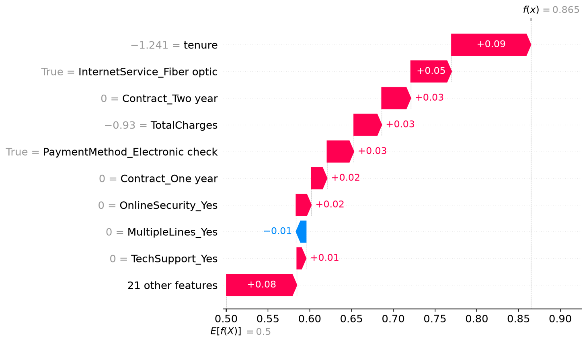
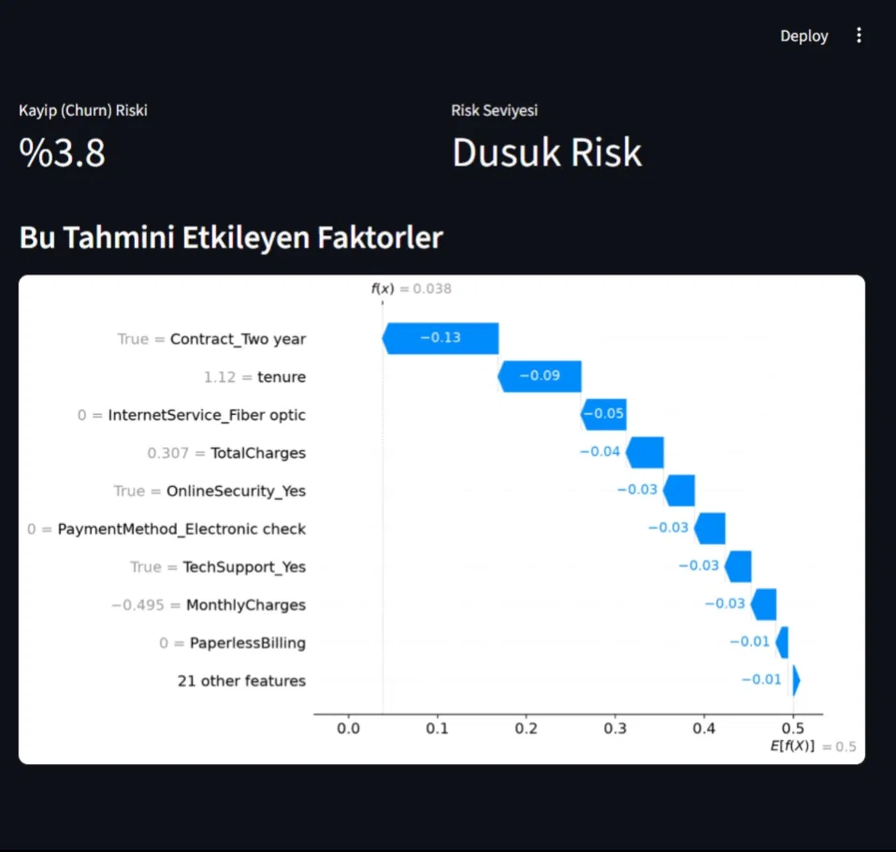

# RiskRadar - Müşteri Kaybı Risk Karar Destek Sistemi

## Problem Tanımı
Telekom şirketleri, hangi müşterilerin yakın zamanda hizmeti bırakma (churn) riski 
taşıdığını önceden bilemediği için müşteri elde tutma kampanyalarını geç başlatmakta 
veya yanlış müşterilere yönlendirmektedir. Bu veri setinde müşterilerin %26.5'i 
hizmeti bırakmıştır. RiskRadar, mevcut müşteri verilerini kullanarak her müşteri için 
bir kayıp riski skoru üretir ve bu riskin hangi faktörlerden kaynaklandığını SHAP ile 
açıklar.

## Hedef Kullanıcı
Telekom şirketinde müşteri ilişkileri / müşteri elde tutma (retention) ekibi.

## Çözümün Kısa Açıklaması
Kullanıcı, bir müşterinin demografik bilgilerini, aldığı hizmetleri ve ödeme 
bilgilerini Streamlit arayüzüne girer. RiskRadar, bu bilgilere göre müşterinin 
kayıp (churn) olasılığını hesaplar, risk seviyesini (Düşük / Orta / Yüksek) gösterir 
ve SHAP waterfall grafiği ile "bu müşteri neden risk taşıyor?" sorusunu yanıtlar.

## Kullanılan Teknolojiler
- Python 3.14
- pandas, numpy — veri temizleme ve hazırlama
- scikit-learn — model eğitimi (Logistic Regression, Random Forest)
- SHAP — model açıklanabilirliği
- matplotlib, seaborn — görselleştirme
- Streamlit — kullanıcı arayüzü
- joblib — model kaydetme/yükleme
- GitHub — proje yönetimi ve sürüm kontrolü

## Sistem Mimarisi
Kullanıcı Girdisi (Streamlit Form)

↓

Veri Ön İşleme (encoding + ölçeklendirme)

↓

Random Forest Modeli (class_weight='balanced')

↓

Churn Olasılığı + Risk Seviyesi

↓

SHAP TreeExplainer → Waterfall Grafiği
## Kurulum Adımları

1. Repoyu klonlayın:
```bash
git clone https://github.com/mineturkmen20-hub/final-projesi-mine-turkmen.git
cd final-projesi-mine-turkmen
```

2. Sanal ortam oluşturun ve aktive edin:
```bash
python -m venv venv
venv\Scripts\activate
```

3. Gerekli kütüphaneleri yükleyin:
```bash
python -m pip install pandas numpy scikit-learn matplotlib seaborn shap streamlit joblib
```

4. Notebook'u çalıştırarak modeli eğitin:
```bash
jupyter lab
```
`notebooks/01_veri_temizleme_ve_eda.ipynb` dosyasını açıp **Run → Run All Cells** ile çalıştırın. Bu adım `models/` klasörüne gerekli dosyaları kaydeder.

5. Streamlit arayüzünü başlatın:
```bash
streamlit run app/app.py
```

## Kullanım Biçimi
Tarayıcıda açılan formda müşteri bilgilerini (demografik, hizmet ve ödeme bilgileri) 
girin, **"Risk Hesapla"** butonuna basın. Sonuç ekranında:
- Churn riski yüzdesi
- Risk seviyesi (Düşük < %30 / Orta %30-60 / Yüksek > %60)
- Bu tahmini etkileyen faktörlerin SHAP grafiği

görüntülenir.

## Örnek Ekran Görüntüleri

### Yüksek Risk (%86.5)


### Düşük Risk (%3.8)


## Test Sonuçları

| Test Senaryosu | Girdi Profili | Tahmin | Risk Seviyesi |
|---|---|---|---|
| Yüksek riskli müşteri | tenure=2, Fiber optic, Month-to-month, Electronic check | %86.5 | Yüksek Risk |
| Düşük riskli müşteri | tenure=60, DSL, Two year, Bank transfer | %3.8 | Düşük Risk |
| Sınır durum | tenure=20, Fiber optic, One year, Credit card | %27.3 | Düşük Risk |
| Sınırlılık testi | InternetService=No ama internet hizmetleri=Yes | %56.2 | Orta Risk |

### Model Performansı (Random Forest, balanced)

| Metrik | Değer |
|---|---|
| Accuracy | 0.765 |
| Precision | 0.540 |
| Recall | 0.775 |
| F1 Score | 0.637 |
| ROC-AUC | 0.840 |

### Model Karşılaştırması (Test Seti)

| Model | Accuracy | Recall | F1 | ROC-AUC |
|---|---|---|---|---|
| Logistic Regression | 0.806 | 0.559 | 0.605 | 0.842 |
| Random Forest | 0.806 | 0.527 | 0.590 | 0.841 |
| Logistic Regression (balanced) | 0.738 | 0.783 | 0.614 | 0.842 |
| **Random Forest (balanced)** | **0.765** | **0.775** | **0.637** | **0.840** |

Cross-validation (5-fold) F1 ortalaması: Logistic Regression 0.598, Random Forest 0.569.
Random Forest (balanced) en iyi F1 ve recall dengesini sağladığı için seçilmiştir.

## Bilinen Sınırlılıklar
- Arayüz, kullanıcı girdilerinin mantıksal tutarlılığını doğrulamıyor (örn. 
  InternetService=No seçildiğinde internet tabanlı hizmetler otomatik 
  devre dışı bırakılmıyor).
- Model, eğitim verisinde görülmemiş kombinasyonlarda güvenilmez sonuç üretebilir.
- Recall odaklı optimizasyon nedeniyle precision görece düşük (%54), 
  yani bazı düşük riskli müşteriler yanlışlıkla riskli olarak işaretlenebilir.
- Veri seti Kuzey Amerika merkezli bir telekom şirketine ait; farklı 
  pazarlarda genelleme sınırlı olabilir.

## Gelecekte Yapılabilecek Geliştirmeler
- InternetService=No seçildiğinde ilgili alanların otomatik gizlenmesi
- Toplu müşteri listesi yükleme (CSV upload) ve toplu risk analizi
- Müşteri segmentlerine göre özelleştirilmiş aksiyon önerileri
- Model yeniden eğitme pipeline'ı (yeni verilerle periyodik güncelleme)

## Yapay Zeka Araçlarının Kullanıldığı Aşamalar
Bu projede Claude (Anthropic) yapay zeka asistanı aşağıdaki aşamalarda kullanılmıştır:
- Proje planlama ve iş akışı tasarımı
- Kod geliştirme (veri temizleme, model eğitimi, SHAP entegrasyonu, Streamlit arayüzü)
- Hata ayıklama (pandas 3.x uyumluluk sorunu, Python 3.14 kütüphane uyumluluğu)
- README ve dokümantasyon yazımı

Tüm kod incelenmiş, test edilmiş ve Mine Türkmen tarafından çalıştırılmıştır.

## Tanıtım Videosu
[Video bağlantısı eklenecek]

## Veri Kaynağı
Kaggle — Telco Customer Churn (blastchar)  
https://www.kaggle.com/datasets/blastchar/telco-customer-churn